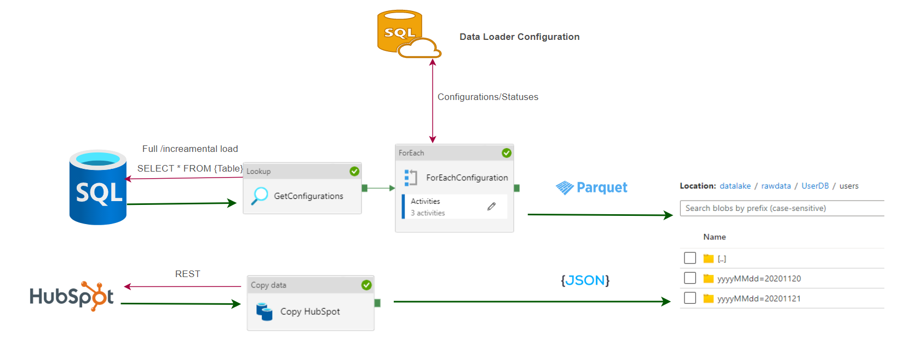
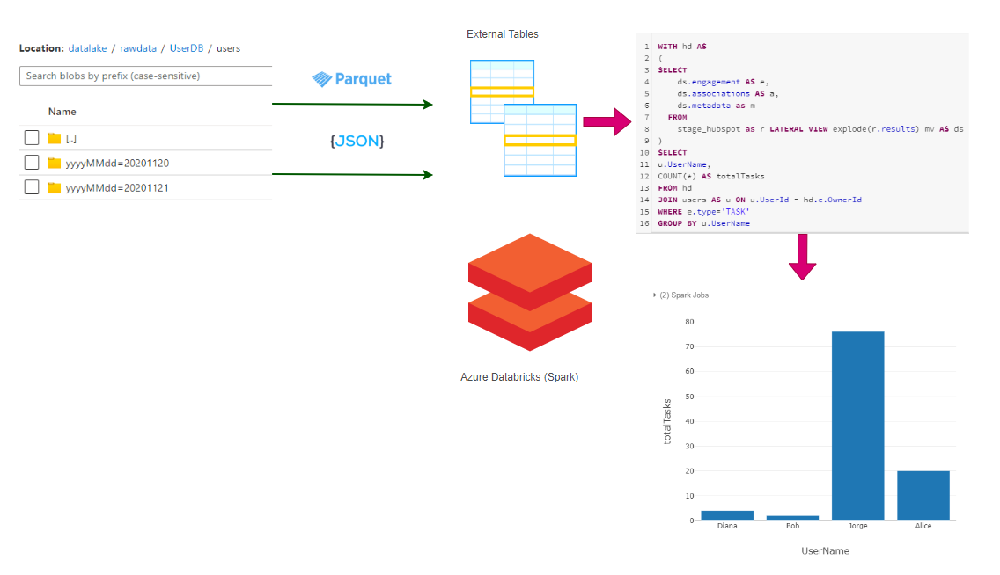
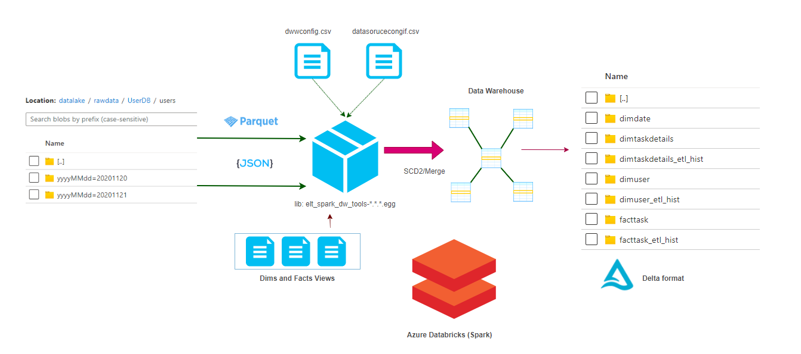
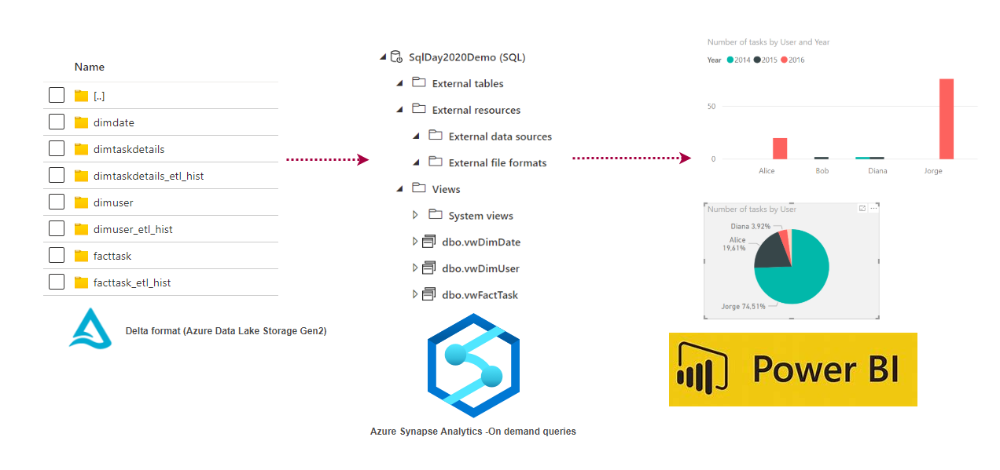

# How to build Lakehouse using Azure Services 

## Azure Services

- Azure Data Lake Storage Gen2 - (Data Store)
- Azure Databricks (Spark) - (Data Lake Exploration,ETL)
- Azure Sysnapse Analytics (On demand Queries) - Serving Layer
- Azure Sql Server (Databases -serverless) - (Sample Data , ELT Metadata)
- Azure Key Vault

## Data Ingestion

## Data Lake Exploration 

## Delta Warehouse

https://github.com/FP-DataSolutions/DeltaWarehouse/

## Serving Layer

